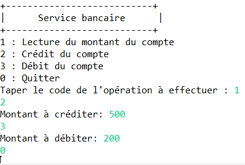

# TP2 - Lab 2

**Objective:** Design, develop, and test a banking application that manages an account, particularly the following operations

- Viewing the account balance,
- Crediting the account,
- Debiting the account.

The client will interact with the application through the menu below, allowing them to perform these various operations consecutively. The CORBA objects will be - Implemented through inheritance.

<table>
  <tr>
    <th>Client</th>
    <th>Server</th>
  </tr>
  <tr>
    <td style="border: 2px solid black;">
      
    </td>
    <td style="border: 2px solid black;">
      
    </td>
  </tr>
</table>
