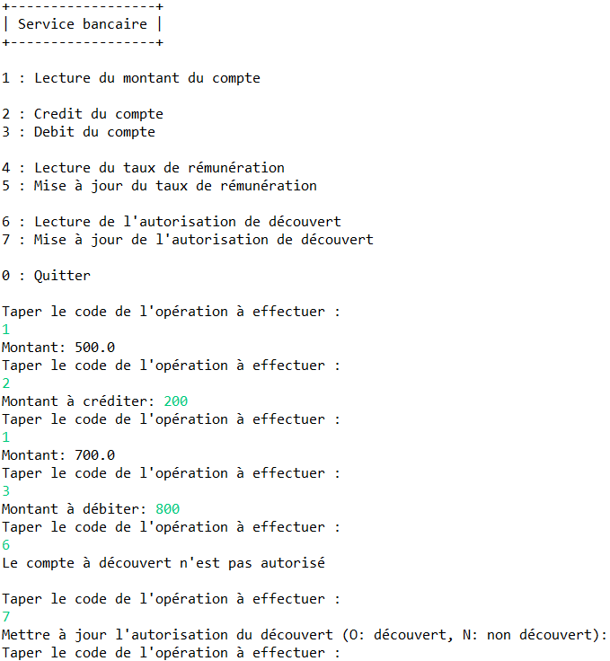
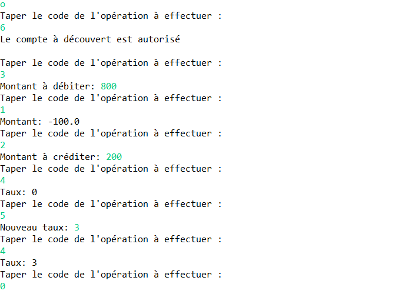
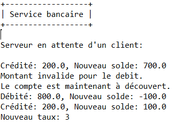

# TP3 - Lab3

Extend the banking application to manage an account (operations for reading the account balance, crediting, and debiting the account) by distinguishing between two categories of bank accounts: 
- `Checking accounts` (`CompteCourant`) (characterized by an authorized overdraft amount: `découvert`) 
- `Savings accounts` (`CompteRemunere`) (characterized by an interest rate: `taux`).

We will introduce a new type of account: the `interest-bearing checking account` (`CompteCourantRemunere`), which possesses the characteristics of the two previous types of accounts.

The client will interact with the application via a menu that allows them to perform various operations on the interest-bearing checking account, including: reading the account balance, crediting the account, debiting the account, reading the interest rate, updating the interest rate, reading the authorized overdraft, and updating the authorized overdraft.

One issue arises from this, CompteCourantRemunere inherits from both CompteCourant and CompteRemunere, which means multiple heritage, which isn't supported in Java!

## Delegation pattern
If we don't want to change the class hierarchy, a possible solution is to use a `delegate` class or `tie` class, which implements or extends the necessary interfaces and/or abstract classes (called `skeletons`).

## Execution of IDLJ
By altering the command that generates the necessary files from the IDL file:
```
idlj -fall -fallTie banque.idl
```

This can generate all the tie file along with the rest of the files.

## Result
<table>
  <tr>
    <th>Client</th>
    <th>Server</th>
  </tr>
  <tr>
    <td>
      
      
    </td>
    <td>
      
    </td>
  </tr>
</table>

